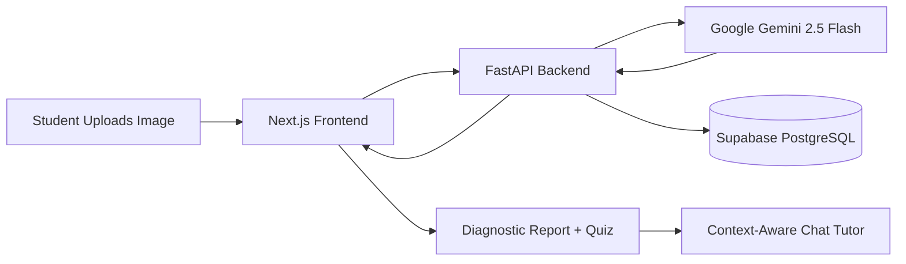

# 🧠 MinerAI: Weak Spot Analyser

[](https://vercel.com/new)
[](https://render.com/)


**MinerAI** is an AI-powered diagnostic and tutoring platform that shifts the educational paradigm from passive answer-dispensing to active concept mastery. By visually diagnosing student errors, isolating root-cause misunderstandings, and generating dynamic assessments, it serves as a highly personalized, 1-on-1 AI educator.

### 🔗 Quick Links
* **Live Deployment (Frontend):** [weak-spot-analyser-murex.vercel.app](https://weak-spot-analyser-murex.vercel.app)
* **Backend API Service:** [weak-spot-analyser.onrender.com](https://weak-spot-analyser.onrender.com)
* **API Documentation (Swagger UI):** [weak-spot-analyser.onrender.com/docs](https://weak-spot-analyser.onrender.com/docs)
* **Repository:** [github.com/GVSASIDHAR/weak-spot-analyser](https://github.com/GVSASIDHAR/weak-spot-analyser)

---

## 📑 Table of Contents
- [Problem Statement](#-theme--problem-statement)
- [Key Features](#-key-features)
- [Architecture](#-architecture)
- [Tech Stack](#️-tech-stack)
- [Folder Structure](#-folder-structure)
- [Local Installation & Setup](#-local-installation--setup)
- [Environment Variables](#-environment-variables)
- [Database Schema](#️-database-schema-summary)
- [API Endpoints](#-key-api-endpoints)
- [Roadmap](#-roadmap)
- [Contributing](#-contributing)
- [License](#-license)
- [Contact](#-contact)

---

## 🌍 Theme & Problem Statement
**Theme:** Sustainability & Social Impact (Domain: Education & EdTech)

### The Challenge
Current EdTech platforms (like Doubtnut or Photomath) act as passive "Answer Dispensers." When a student uploads a flawed calculation or broken code snippet, these tools simply output the correct final answer while ignoring the student's actual logic. Students are told *that* they are wrong, but never *why*, which leads to cognitive overload, frustration, and rote copying instead of actual conceptual understanding.

### Our Solution
We built a multimodal AI diagnostic engine that analyzes an uploaded image of a student's error, targets their specific root-cause misunderstanding, and dynamically quizzes them to ensure active mastery. This democratizes high-quality, 1-on-1 academic intervention for any student with an internet connection, leveling the educational playing field for underserved learners.

---

## ✨ Key Features
* **Frictionless Ingestion:** An intuitive drag-and-drop interface and webcam scanner to instantly digitize physical worksheets or digital screenshots.
* **Root-Cause Diagnostics:** Generates a structured breakdown of the student's exact "Weak Spot," explaining the missing prerequisite concept and providing an immediate fix.
* **Context-Aware AI Tutor:** An embedded chat interface that retains the memory of the specific uploaded error, allowing students to ask Socratic, follow-up questions.
* **Dynamic Quiz Generation:** Synthesizes customized, on-demand multiple-choice assessments based entirely on the user's isolated knowledge gap.
* **Persistent Learning Profiles:** Securely logs all diagnostic reports and quizzes to a relational database, allowing students to track their long-term academic progress.

---

## 🏗️ Architecture



1. Student uploads a worksheet image or screenshot via the frontend.
2. The backend forwards the image to Gemini 2.5 Flash for multimodal analysis.
3. The AI isolates the root-cause error and returns a structured diagnostic payload.
4. The result is persisted to Supabase and rendered back to the student, along with a dynamically generated quiz and a follow-up chat tutor.

---

## 🛠️ Tech Stack

### Frontend (Client-Side)
Next.js, TypeScript, Tailwind CSS, Lucide React, `@supabase/supabase-js`

### Backend (Server-Side)
Python 3, FastAPI, Uvicorn, Requests, `python-dotenv`, `supabase-py`, Google Gemini 2.5 Flash, official `google-genai` SDK

### Database
PostgreSQL (hosted on Supabase), Supabase Auth

### Deployment
Vercel (frontend), Render (backend)

---

## 📁 Folder Structure

```
weak-spot-analyser/
├── frontend/                # Next.js app
│   ├── app/                 # App router pages
│   ├── components/          # Reusable UI components
│   ├── lib/                 # Supabase client, helpers
│   └── public/               # Static assets
├── backend/                  # FastAPI service
│   ├── main.py               # App entrypoint
│   ├── routers/               # API route modules
│   ├── services/               # Gemini + Supabase integration logic
│   └── requirements.txt
└── README.md
```

---

## 🚀 Local Installation & Setup

### 1. Clone the Repository
```bash
git clone https://github.com/GVSASIDHAR/weak-spot-analyser.git
cd weak-spot-analyser
```

### 2. Frontend Setup (Next.js)
```bash
cd frontend
npm install
```

Create a `.env.local` file in the `frontend` directory (see [Environment Variables](#-environment-variables)).

Run the development server:
```bash
npm run dev
```

### 3. Backend Setup (FastAPI)
```bash
cd backend
python -m venv venv
source venv/bin/activate  # On Windows use `venv\Scripts\activate`
pip install -r requirements.txt
```

Create a `.env` file in the `backend` directory (see [Environment Variables](#-environment-variables)).

Run the Uvicorn server:
```bash
uvicorn main:app --reload --port 8000
```

The API will be available at `http://127.0.0.1:8000`, with interactive docs at `http://127.0.0.1:8000/docs`.

---

## 🔑 Environment Variables

**Frontend (`frontend/.env.local`)**

| Variable | Description |
| --- | --- |
| `NEXT_PUBLIC_SUPABASE_URL` | Your Supabase project URL |
| `NEXT_PUBLIC_SUPABASE_ANON_KEY` | Supabase anonymous/public API key |
| `NEXT_PUBLIC_BACKEND_URL` | Base URL of the FastAPI backend (e.g. `http://127.0.0.1:8000`) |

**Backend (`backend/.env`)**

| Variable | Description |
| --- | --- |
| `GEMINI_API_KEY` | Google Gemini API key |
| `SUPABASE_URL` | Your Supabase project URL |
| `SUPABASE_KEY` | Supabase service role key (server-side only, keep secret) |

> ⚠️ Never commit `.env` or `.env.local` files. Add them to `.gitignore`.

---

## 🗄️ Database Schema Summary

The application relies on a strict relational structure hosted on PostgreSQL:

| Table Name | Primary Purpose | Foreign Key Relations |
| --- | --- | --- |
| `users` | Manages authenticated user profiles | Auth system |
| `error_submissions` | Stores AI diagnostic payload & image URLs | Links to `users` |
| `quizzes` | Master record for generated assessments | Links to `error_submissions` (Cascade) |
| `quiz_questions` | Individual multiple-choice questions | Links to `quizzes` (Cascade) |

---

## 📡 Key API Endpoints

| Method | Endpoint | Description |
| --- | --- | --- |
| `POST` | `/api/analyze` | Upload an image and receive a structured diagnostic report |
| `POST` | `/api/quiz/generate` | Generate a dynamic quiz from a diagnostic report |
| `POST` | `/api/chat` | Send a follow-up question to the context-aware AI tutor |
| `GET` | `/api/submissions/{user_id}` | Retrieve a user's diagnostic history |

> Full interactive documentation is available via Swagger UI at `/docs`.

---

## 🗺️ Roadmap
- [ ] Support for handwritten multi-step math proofs
- [ ] Voice-based follow-up questions to the AI tutor
- [ ] Teacher/parent dashboard for progress analytics
- [ ] Offline-first PWA support for low-connectivity regions
- [ ] Multi-language diagnostic support

---

## 🤝 Contributing

Contributions are welcome!

1. Fork the repository
2. Create a feature branch (`git checkout -b feature/your-feature`)
3. Commit your changes (`git commit -m "Add your feature"`)
4. Push to the branch (`git push origin feature/your-feature`)
5. Open a Pull Request

Please open an issue first to discuss major changes.
